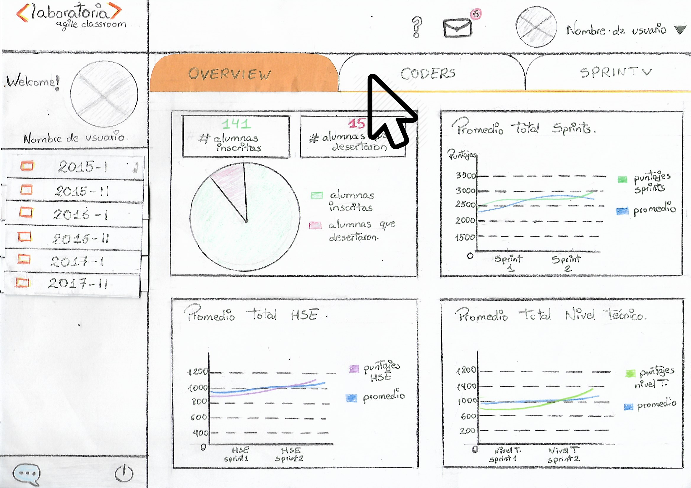

# DASHBOARD - LABORATORIA

* **Reto**
* **Alumna:** Yosseline Apcho Huaman.

***

## Objetivo:

 Nuestra "misión" será realizar un sketch del Dashboard de Laboratoria, utilizando títulos y textos reales, y teninedo muy en cuenta los elementos de navegación.

## Explicando Dashboard:

 

 - Antes de poder acceder a toda la información del dashboard, deberás iniciar sesión. Y si no la tienes, deberás crearte una. Pero ojo, solo personal autorizado puede acceder a todos los datos que otorga el dashboard, puesto que, al momento de crear una cuenta, nos piden una contraseña que solo profesores, training managers, directores y gerentes de Laboratoria han de conocer.

 

 - Éste sería el contenido principal del Dashboard, o el contenido que se mostraría una vez ingresado nuestros datos. Pero si hacemos click en el botón que dice "LIMA", se nos desplegará una lista de opciones.

 

- Ok. Aquí se muestra la lista, pero no la necesitaremos por en momento. Ahora. al dar click en "CODERS"...

- Nos mostrará toda la información necesaria de las alumnas, turno mañana y turno tarde. Y la comparación de sus avances.

- Si damos click en "SPRINT"...

- Se nos desplegará una lista con todos los nombres de los sprints. En este caso, "clicklearemos" en Programación básica.

- Y .. wooala! Nos muestra toda la información que necesitamos saber sobre los sprints.
